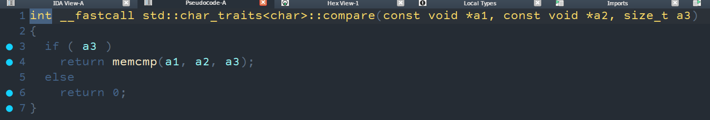

---
params:
  authors:
    - name: falamous
      social: https://t.me/falamous
      links:
        - name: channel
          link: https://t.me/theinkyvoid
title: "ctfcup 2024 - olymp"
tldr: "unsolved crypto pwn task from a ctfcup organized by us"
date: "2024-10-31"
tags: [pwn, crypto]
summary: |
  An "olymp problem" solution with a simple buffer overflow with some interesting leak techniques, complicated by the fact that we can only overflow a prefix polymial hash.
---

# olymp (ctfup 2024)

I was running out of time organizing ctfcup 2024, especially conserning pwn challenges. But then I thought what about an algorithmic pwn challenge and thus olymp was born. Sadly no one was able to solve it during the ctf, thus I am publishing this writeup.

## Quick summary

The task is basicly solving a problem, where given a string `s` answer queries of the form `compare s[a:b] s[c:d]`. To this end it first inputs the number of test cases, then for each test case reads a string from `std::cin` into a `std::string` variable on `bss`, builds the prefix hash array, reads the number of queries from `std::cin` (which will be important later), then for each query reads four numbers, compares appropriate string computed hashes and if those are equal compares the substrings themselves.

## The vuln

The vuln is quite easy to spot when reading the source code (which was provided). There is no control over how much prefix hashes we build, meaning we can overflow into `s`, where conveniatly the first field is the data pointer, allowing us to get arbitrary write (PIE was disabled).
```c++
#define MAX_LENGTH 200

using namespace std;

uint64_t prefix[MAX_LENGTH];

string s;

void build_prefix_hashes() {
  uint64_t h = 0;
  prefix[0] = h;
  for (int i = 0; i < s.size(); i++) {
    h = h * 31337 + s[i];
    prefix[i + 1] = h;
  }
}
```


## Forging a hash

Before we can exploit the overflow we have to be able to create such a string, that its polymial hash is equal to arbitrary value `target`. Lets refolmulate the problem in terms of lattices, the polymial hash of string `s` is equal to `P(s) = p ^ (len(s) - 1) s[0] + p ^ (len(s) - 2) s[1] + ... + p ^ 0 s[len(s) - 1] mod P`, pick the middle of the alphabet `ord('n')`, we want to find the minimal vector satisfying `P(midle * len(v)) - P(v) = 0`, for which the corresponding lattice is
```python
L = IntegerLattice(
    [
        [W * Q ** (len(known) - i - 1)]
        + [1 if j == i else 0 for j in range(len(known))]
        for i in range(len(known))
    ]
    + [[W * P] + [0] * len(known)]
)
```
Then we just use `L.approximate_closest_vector` from sage and obtain our string.

## Leaking libstdc++

The easiest thing we can do is overwrite `std::istream::operator>>(int &)` to `puts`. Then it will be called with `std::cin` as the first argument and thus we can leak libstdc++. I thought that was enough and libstdc++ would always allocate after libc, but during final testing that turned out not to be case.

## Leaking libc

Leaking libc on the other hand is a bit more tricky. First we have to notice that comparing two substrings actually uses `memcmp`



We can overwrite `memcmp` with `puts` and the rest of the got with the resolvers. Then call the comparison on the same indexes (such that the first index corresponds to `memcmp` got) two times (which intern will call puts): the first to resolve puts, the second to leak it.

## Running system

Finally we can use the same `memcmp` trick: overwrite `memcmp` with `system`, `setvbuf` got with `"sh\x00"`, the run the comparison on `0 1`, intern calling `system("sh\x00")`. You can check the full sploit [here](sploit.py).

## Conclusion

Overall I thought the challenge was quite easy, but it turned to be quick tricky even after the forging of the hash was fully hinted.
