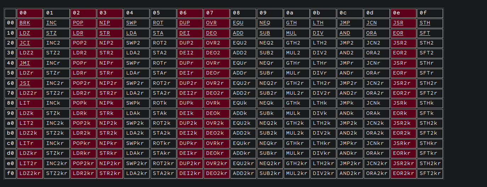

---
params:
  authors:
    - name: falamous
      social: https://t.me/falamous
      links:
        - name: channel
          link: https://t.me/theinkyvoid
title: "google ctf 2024 - auxin2"
tldr: "codegolf uxntal assembly challenge"
date: "2024-06-25T18:22:53+03:00"
tags: [misc]
summary: |
  we were given a rom for the varvara system running on uxntal assembly. the rom loads the provided shellcode into memory, checks for some forbidden bytes and runs it. the goal is to read the flag located at `"flag"`.
---

## basics

we were given a rom for the varvara system running on uxntal assembly. the rom loads the provided shellcode into memory, checks for some forbidden bytes and runs it. the goal is to read the flag located at ```"flag"```.

## the rom

the provided script simply runs
```python
subprocess.run(['./uxncli', 'auxin2.rom', s], timeout=0.5, capture_output=True)
```
and gives us the output. The [rom](auxin2.rom) then loads the provided hex encoded code to address to address ```0x1d0```, checks the the lower 4 bits of each bytes are not in ```[0, 2, 3, 6, 7, 0xe]``` and if thats true executes it. the last thing is that our output must be <= 112 bytes.

## shellcode without any constraints

what we do is basicly communicate with the io through ```DEO``` and ```DEI``` to load the flag at a specific address (0x151) and then write a single byte from an offset from that address. that would allow us to leak the flag one byte at a time. anyway here is the shellcode:
```
|01d0
;filename #a8 DEO2     ( set address of file path )
#00ff #aa DEO2         ( set 0xff len to read )
#0100 #ac DEO2         ( set address for the data to read, and do read )
#a2       DEI2
#0100     LDA
#18       DEO

@filename
    "flag 00
```

## hitriy plan

after some delibiration what we came up with was writing a self-modifying shellcode, where the last n bytes are the shellcode itself without the forbidden bytes, and the prior bytes modify the shellcodes, so that it contains forbidden bytes. here is the instruction table (forbidden instruction are marked in red): 

so no push, ```POP```, ```DEO```, ```DEI``` or ```DUP```... luckely most instructions in this assembly comes with a ```k``` variant, meaning the instruction will execute, but will not pop values from the stack. since the ```INC``` instruction is allowed what we came up with was:
given the address of the forbidden instruction in the the shellcode have the value at that address initially be ```target_value - 1``` or ```target_value - 2``` (since for example both 2 and 3 are forbidden) and then execute:
```
[address] LDAk
[address, value] INC (maybe x2)
[address, value + (1 or 2)] SWP
[value + (1 or 2), address] STAk
```
which we call shorter and longer trick respectively. then just increment the address until we find the next forbidden byte. so since our payload was 30 bytes, this took around 120 bytes without obtaining the address.

## optimizations

the first optimization was to change some ```DEO2``` instructions to ```DEO```. the other optimization needs some explaining. say we have 2 consecutive forbidden bytes (in the sense that there are no other forbidden bytes between them, but there maybe allowed bytes between them). then the state of the stack would ```[value, address]```, which as we may notice is exactly what we want. so we can just run ```STAk```. so we reorded some pushes so that the forbidded push instuctions are right after one another. this

## final code

it turned out we could not use the shorter trick since the address is a 16 bit number and value is a 8 bit number. luckely since the virtual machine is big endian we can just replace all the instructions to their 16 bit variants and it still works:
```
LDA2k INC2 SWP2 STA2k
```
the final thing we had to do was to obtain the address 0x223 (where our shellcode to be changed started) and luckely one of our teammates came up with a way do so using the initial state of the stack ([02, 04]). all we had to do then is implement the [program](decoder.tal) and write a short [script](pepe.py) which would subsitute the address that we read from to 0x151 + offset and use one of the tricks on it if neccessary. the uxn binaries needed to run the script can be downloaded from [here](https://git.sr.ht/~rabbits/uxn).

## flag
CTF{Sorry__n0_Music_thi5_t1m3}

## conclusion
pretty interesting, but quite simple codegolf challenge. interestingly the final program only had 3 or so bytes to spare, so we were pretty close to the limit
