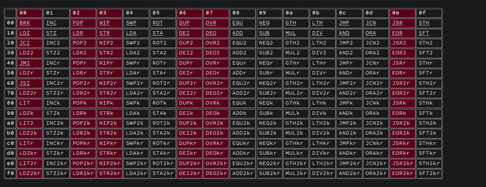

---
params:
  authors:
    - name: falamous
      social: https://t.me/falamous
      links:
        - name: channel
          link: https://t.me/theinkyvoid
title: "Google CTF 2024 - auxin2"
tldr: "codegolf uxntal assembly challenge"
date: "2024-06-25T18:22:53+03:00"
tags: [misc]
summary: |
  We were given a ROM for the Varvara system running on Uxntal assembly. The ROM loads the provided shellcode into memory, checks if the lower 4 bits of each byte are not in [0, 2, 3, 6, 7, 0xe], and if true, executes it. The goal is to read the flag located at "flag".
---

## Basics

We were given a ROM for the Varvara system running on Uxntal assembly. The ROM loads the provided shellcode into memory, checks if the lower 4 bits of each byte are not in [0, 2, 3, 6, 7, 0xe], and if true, executes it. The goal is to read the flag located at `flag`.

## The ROM

The provided script simply runs:
```python
subprocess.run(['./uxncli', 'auxin2.rom', s], timeout=0.5, capture_output=True)
```
and gives us the output. The [ROM](auxin2.rom) loads the provided hex-encoded code to address 0x1d0, checks the lower 4 bits of each byte, and executes it if they are not forbidden. Our output has to be <= 112 bytes.

## Shellcode Without Constraints

We communicate with the I/O through `DEO` and `DEI` to load the flag at a specific address (0x151) and then write a single byte from an offset. This allows us to leak the flag one byte at a time. Here is the shellcode:

```
|01d0
;filename #a8 DEO2     ( set address of file path )
#00ff #aa DEO2         ( set 0xff len to read )
#0100 #ac DEO2         ( set address for the data to read, and do read )
#a2       DEI2
#0100     LDA
#18       DEO

@filename
    "flag 00
```

## Initial Plan

After deliberation, we decided to write a self-modifying shellcode, where the last n bytes are the shellcode itself without forbidden bytes, and the prior bytes modify the shellcode to contain forbidden bytes. Here is the instruction table (forbidden instructions are marked in red): 

No `PUSH`, `POP`, `DEO`, `DEI`, or `DUP` are allowed. Luckily, most instructions in this assembly come with a `k` variant, meaning the instruction will execute but not pop values from the stack. Since the `INC` instruction is allowed, we come up with the following plan:

Given the address of the forbidden instruction in the shellcode, we have the value at that address initially be `target_value - 1` or `target_value - 2` (since, for example, both 2 and 3 are forbidden), and then execute:

```
[address] LDAk
[address, value] INC (maybe x2)
[address, value + (1 or 2)] SWP
[value + (1 or 2), address] STAk
```

We call this the shorter and longer trick, respectively. Then, we increment the address until we find the next forbidden byte. Since our payload is 30 bytes, this takes around 120 bytes without obtaining the address.

## Optimizations

The first optimization is to change some `DEO2` instructions to `DEO`. The other optimization needs explanation. If we have two consecutive forbidden bytes (in the sense that there are no other forbidden bytes between them, but there may be allowed bytes), then the state of the stack is `[value, address]`, which is exactly what we want. So, we can just run `STAk`. We reorder some pushes so that the forbidden push instructions are right after one another.

## Final Code

It turns out we cannot use the shorter trick since the address is a 16-bit number and the value is an 8-bit number. Luckily, since the virtual machine is big-endian, we replace all the instructions with their 16-bit variants, and it still works:

```
LDA2k INC2 SWP2 STA2k
```

The final step is to obtain the address 0x223 (where our shellcode to be changed starts). Luckily, one of our teammates comes up with a way to do so using the initial state of the stack ([02, 04]). All we have to do then is implement the [program](decoder.tal) and write a short [script](pepe.py) which substitutes the address we read from to (0x151 + offset) and uses one of the tricks on it if necessary. The Uxn binaries needed to run the script can be downloaded from [here](https://git.sr.ht/~rabbits/uxn).

## Flag
CTF{Sorry__n0_Music_thi5_t1m3}

## Conclusion
A pretty interesting but relatively simple code golf challenge. Interestingly, the final program has only 3 or so bytes to spare, so we are quite close to the limit.
