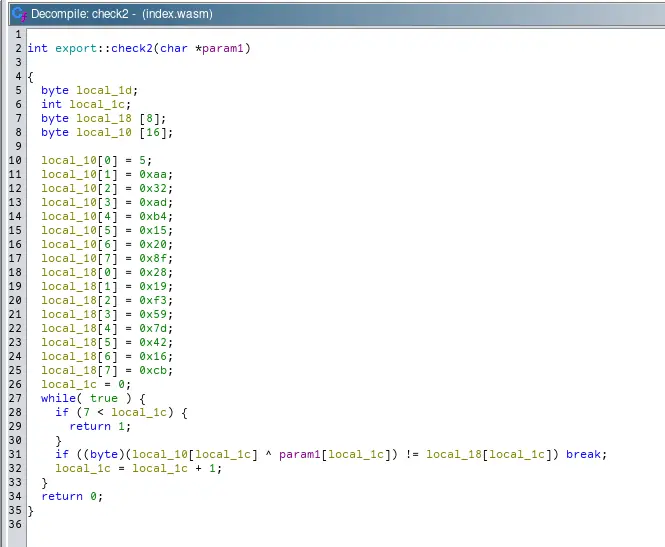
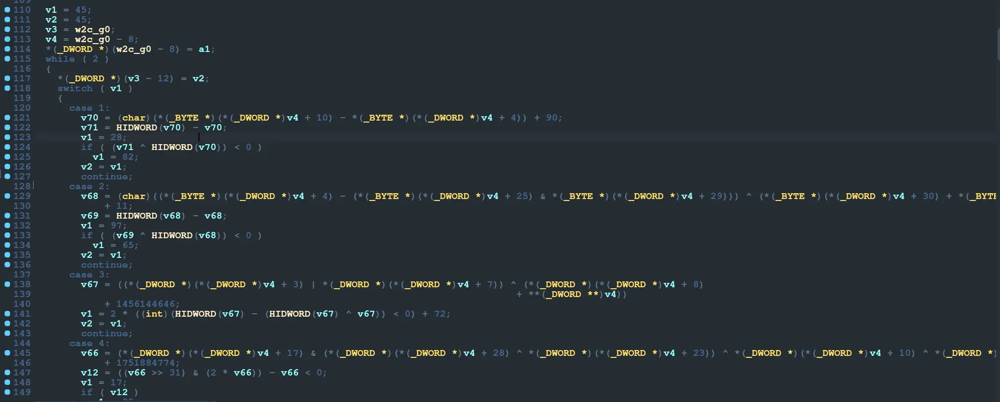

---
params:
  authors:
    - name: "falamous"
      social: https://t.me/falamous
      links:
        - name: channel
          link: https://t.me/theinkyvoid
title: "SAS CTF 2024 - CK0P0 CTYXHET writeup"
tldr: "challenge we solved by running angr on a binary generated from pseudocode of the wasm file"
date: "2024-05-21T22:24:53+02:00"
tags: [reverse]
summary: |
  We were given a website that loads a WASM module. The website splits a string into 6 parts, then runs 6 different WASM check functions on the parts. If they are successful, it gives us the flag. I used wasm2ida to get an ELF binary with the same code and Ghidra with the WASM plugin to get decompilation. The checks themselves looked SMT-solvable, so I first tried to use Z3 but failed miserably. I then went on to use angr on a binary I wrote myself with the functions copied from disassembly.
---

## Basics

We were given a website that loads a WASM module. The website splits a string into 6 parts, then runs 6 different WASM check functions on the parts. If they are successful, it gives us the flag. I used [wasm2ida](https://github.com/vient/wasm2ida) to get an ELF binary with the same code and Ghidra with the WASM plugin to get decompilation. The checks themselves looked SMT-solvable, so I first tried to use Z3 but failed miserably. I then went on to use [angr](solve.py) on a [binary](sim.c) I wrote myself with the functions copied from disassembly.

## Checks 1-5

Checks 1-5 are very simple, and I was able to copy them from Ghidra pseudocode. They ran correctly after a few type changes. Here's a sample:

## Check 6

Check 6 is a different story. In Ghidra, it looks horrible. However, by recompiling with wasm2ida, we get a simplified state machine. There's a main loop with a switch case on `v1`, and then there are many cases. Each case checks some condition, then depending on whether it is true or not, jumps to one of two cases. Here's what it looks like:

## DFS

The first thing I did was parse the pseudocode to get a list of cases and their children with [parse.py](parse.py). From there, it was simple to write a DFS to find the sequence of cases that lead to the target case (which makes the function return `true`). Curiously, it seems that most, if not all, conditions in the correct sequence are false. Perhaps this was a design oversight by the challenge authors.

## Check 6: First Try

Next, I copied the pseudocode for Check 6 from IDA (because it was simpler than the one from Ghidra). I wrote a simple program that accepts 6 command line arguments and runs all 6 checks on the supplied arguments. Not without troubles, I ran it through angr, exploring until I found an address that means all checks are satisfied. Here I ran into an issue: the angr script was taking too long. Not to be deterred, I devised a scheme. Instead of just looking for the target address, I would instead look for the address of each case in the correct sequence in a loop. That looked more promising, but on the 49th iteration, it took 38 GB of memory. So I rented a VPS with 200 GB of RAM and ran it there, but it failed with an error.

## Check 6: Second Try

What worked was a different approach. For each condition in the correct sequence, I copied it and added an if statement. If the resulting `v1` is incorrect, the function will return 0. If all conditions are met, the function will return 1. That also took a lot of memory, but a manageable amount. All that was left was to feed the script output to the `perform_hack` function in the browser, and the flag was in our hands.

SAS{0k_u_54v3d_7h3_p14n37_n0w_u_5h0u1d_61v3_m34n1n6_70_l1f3}

## Conclusion

All in all, this was not a very difficult challenge, but it took far longer than expected. This was my first time using angr, and I'm not impressed, to put it mildly: the script was slow and consumed more than 20 GB of memory. However, it was an interesting experience nonetheless.

I also want to point out that if you want to copy code from IDA like I did, there is a convenient [header file](https://gist.github.com/Dliv3/d011325312292182a9674797761d2b41) that defines all the "built-in" IDA types and macros.
