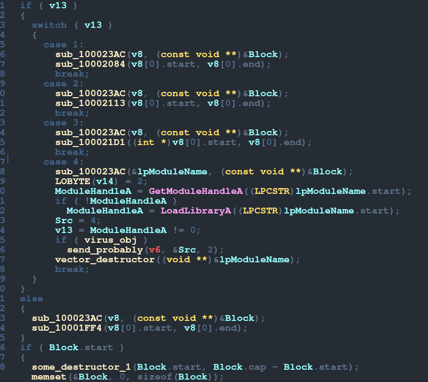
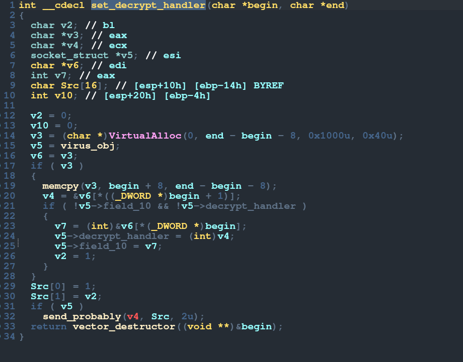
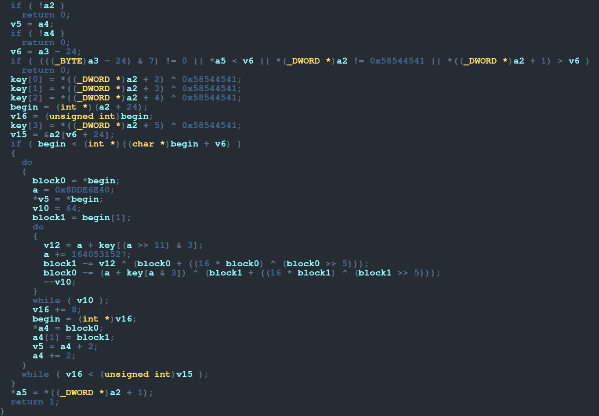
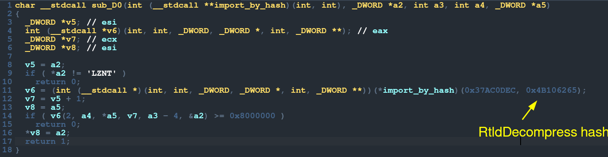
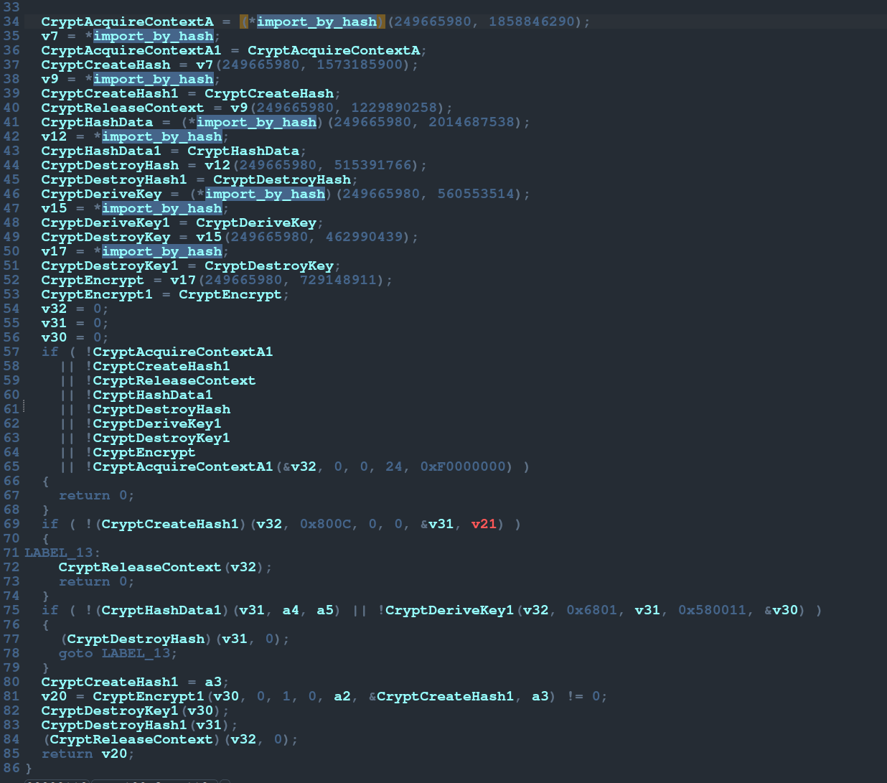

---
params:
  authors:
    - name: "falamous"
      social: https://t.me/falamous
      links:
        - name: channel
          link: https://t.me/theinkyvoid
title: "TeTCTF 2024 - APT"
tldr: "an interesting malware reverse engineering task"
date: "2024-05-21T22:24:53+02:00"
tags: [reverse]
---

# Advanced Persistent Threat (TeTCtf 2024)

to be honest we started playing TetCTF for imaginary rating points, but it turned out to be a pretty cool ctf overall. one of the better challenges i solved was APT (advanced persistent threat):

## loaders
basicly we were given a malware sample (wether it was "real" or not is to be determined), a traffic dump and a file supposedly encrypted by it (important_note.txt). The sample consisted of a small binary (MsMpEng.exe), a binary file (AmMonitoringProvider.mof) and a dll (mpsvc.dll). the binary calls ServiceCrtMain from the dll and there its purpose is concluded. ServiceCrtMain opens the binary file, decrypts it (using the first 256 bytes of the dll as the key), then maps it to executable memory. It then passes that address as callback to LineDDA. with the help of one my teammates we managed to dump the afformantioned memory to file. i could have reverse engineered it, but having binwalked it, i isolated the part of the dump that was a dll (no doubt being loaded by the dumped code) and started analyzing this (virus.dll) dll, which was the right call.

## malware
the dll turned out to be the real malware, not just yet another loader. DllMain uses the same LineDDA trick to make debugging harder. so i procided with static analysis. what seems to be the main function is busy initializing some structs: the first one `funcs` is a structure that holds pointers to some functions, most of which are builtin, but two are custom. i skipped them for now and only ended up comming back to one of them much much later; the second `virus_obj` is the main object operated on, it contains the cnc host "totally-not-malicious-host.local" and port 1337 (of course) and a set of other strange fields initially set to zero; the last one `some_tree` was somewhat of an enigma that i only ended up figuring out near the very end. next the main loop. first comes a pretty clean connect function. then the loop. while some field of the virus_obj is non zero (which is some health var, here named working), 3 functions are executed.

## starting reverse engeenering
the first one looks very complicated, but after looking at it for a while, a figured out it operated on some sort of vector (or std::string) structure. then some 10 minutes later i marked out some common functions: something that looked like an append and a couple of destructors. the first call here is actually a clean function, which recv's 4 bytes (the header) which must be b"\xbe\xba\xfe\xca", then 4 bytes - int - length and then length bytes of the actually packet. after that some complicated mess happens, but that didn't concern me at that point as i moved on to the third function.

## main switch case
i skipped the second function as it looked compilery and complicated, as apposed to the third which looked quite logical. it mainly consists of a simple switch case based on the first character of the parameter (the packet), so a typical set of commands. to add to that the commands themselves looked quite typical: some common prepare functions, a handler (to which the parametrs are the begin and end of the packet vector offset by on - the command itself).

## case 4
the simplest command is command 4, which simply tries to load a dll and then calls some function on 2 bytes of a result. that function looks a lot like the recv function, but i reverse: first some similar nonsense, then a clean send function (which sends b"\xbe\xba\xfe\xca", 4 bytes of length and then the packet).

## case 1
the next command used - 1 is a bit more comlicated. it allocates some executable memory, writes the packet offseted by 8 into it. then takes the first and second 4 bytes as offsets to 2 parts of the memory - 2 functions, then puts those addresses into the global `virus_obj` struct. so of course a pulled the code out of the traffic and analyzed it. but first i back referenced where those virtual functions were used: recv and send. as the functions looked cryptographic and the traffic later appeared to be encrypted and espicially because the second one (decrypt) checked that the buffer it was given as an argument started with b"AETX" which appeared a lot in traffic, i found out these were the encryption and decryption handlers set by the cnc. called before sending and after recving in a specific way (with `funcs` as the first argument, input pointer, size) which will be a common pattern. so i implemented the decryption in python and started decrypting the following traffic.

## case 0
next command (0 i think) which is exactly the same in principle: the handler is executed after decryption, before encryption, but is seems to uses hash importing. the function in funcs at offset 0 is probably then some `import_by_hash`, but i didn't reverse engineere it yet. instead by some miracle after googling the hash of the function name i found some indian shellcode project which happened to use the exact same hash and figured out the hash was of the function RtlDecompress. some googling constants later and i installed a lznt1 library to decompress the decrypted packets. the malware somewhat assembles itself from the cnc: first encryption, then compression; which is a interesting concept, by personaly if i were writing malware i would at least provide some defaults.

## last packet
it seemed no other handlers were added so i proceeded right to the last packet which contained some juicy constants "encrypted_by_pepega" and "important_note.txt" - probably the encryption key and file to encrypt. the command 3 in this packet starts with a call to tree function - lower bound. the tree in question is only referenced a couple of times: in its initialization and in another command - 2. and it just so happens that there is a huge packet with command 2. the command 2 looks quity simple - just an insert. so command 3 operates on the inserted data. first it decrypts it a similar but the same fashion to the decryption handler and then calls the decrypted data like a handler. so i implemented this decryption - decrypt2 in python, decrypted the code and started analyzing it. the code contains 3 functions, the first one is a parser and so does not concern us, it calls the last on our packet data. the second uses a lot of importing by hash and so reverse engineering that functionality was now inevitable.

## the encryption function
I was kind of familiar with import by hash, but i though it was some builtin hash that was used. having dug a bit deeper i found out instead the way it works is you iterate over all of the modules, computes the hash of their name, then if the hash matches it returns the module. same thing for functions in a module. i started francticly searching for a list of all winapi function. some 40 minutes later, i got desparate. i had a handy dandy bit of code from a shellcode project that would find the function in a module with the exact same hash function (because i got lucky remember). so i took a list of all of the dll currently installed on my wine and iterated over all them, trying to find the function inside of it. it i did i would print its name. with little hack i was able to get the names of all the hash imported functions in no time. the third function ammounted to opening the file, maping it in memory, then calling `sub_100(funcs, mapped_file, '_'.join(key, GetComputerNameA()), GetUserNameA))`. the second function `sub_100` hashes the key using sha256, seeds that to ARC4 and encrypts the mapped file with that. needless to say i found both the computer name and the username in some outgoing packets. i implemented the whole thing in c with winapi, it worked and i got the flag.

one last sour note is that for some reason i had to seed the hash with string AND the nullbyte, which wasted a bit of time.

## conclusion
this was a very interesting challenge and a neat intro into malware reverse engineering.

## socials
- [https://t.me/falamous](https://t.me/falamous)
- [https://t.me/theinkyvoid](https://t.me/theinkyvoid)
