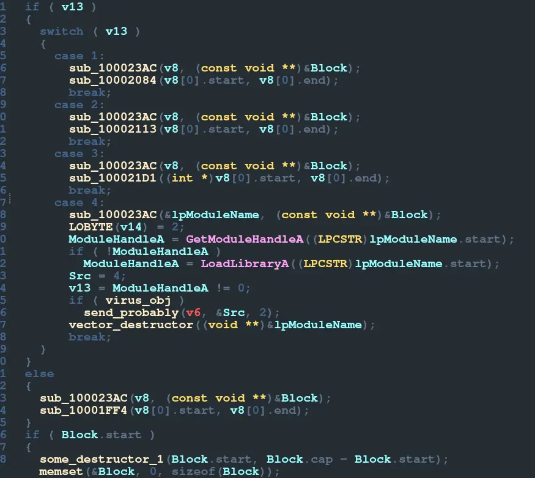
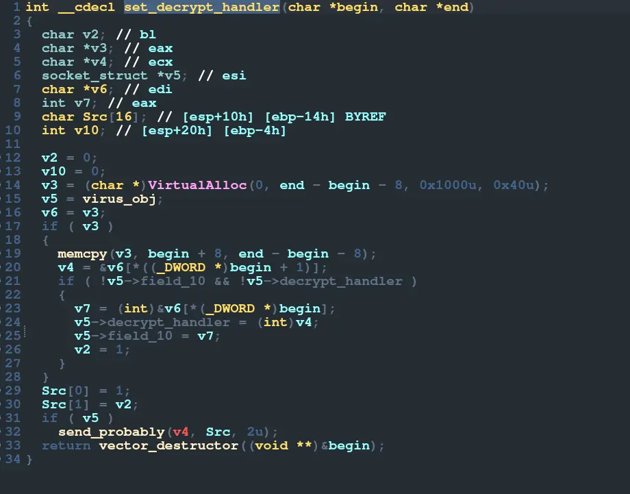
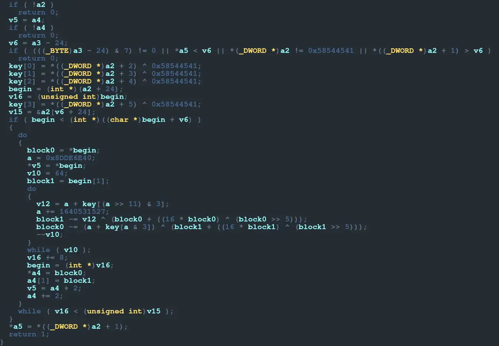
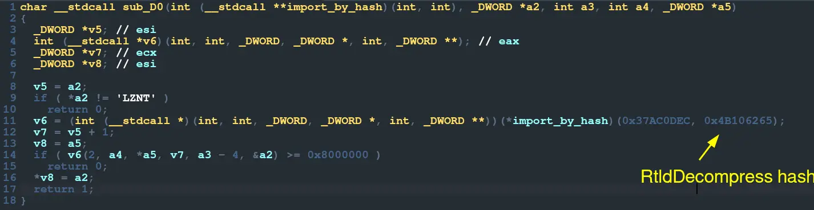

---
params:
  authors:
    - name: falamous
      social: https://t.me/falamous
      links:
        - name: channel
          link: https://t.me/theinkyvoid
title: "TeTCTF 2024 - APT"
tldr: "interesting malware reverse engineering task"
date: "2024-05-23"
tags: [reverse]
summary: |
  Basically, we were given a malware sample (whether it was "real" or not is to be determined), a traffic dump, and a file supposedly encrypted by it `important_note.txt`. The sample consisted of a small binary `MsMpEng.exe`, a binary file `AmMonitoringProvider.mof`, and a DLL `mpsvc.dll`. The binary calls `ServiceCrtMain` from the DLL and there its purpose is concluded. `ServiceCrtMain` opens the binary file, decrypts it (using the first 256 bytes of the DLL as the key), then maps it to executable memory. It then passes that address as a callback to `LineDDA`. With the help of one of my teammates, we managed to dump the aforementioned memory to a file. I could have reverse engineered it, but having binwalked it, I isolated the part of the dump that was a DLL (no doubt being loaded by the dumped code) and started analyzing `malware.dll`, which was the right call.
---

# Advanced Persistent Threat (TeTCTF 2024)

To be honest, we started playing TetCTF for imaginary rating points, but it turned out to be a pretty cool CTF overall. One of the best challenges I've solved was APT (Advanced Persistent Threat):

## Loaders

Basically, we were given a malware sample (whether it was "real" or not is to be determined), a traffic dump, and a file supposedly encrypted by it [important_note.txt](important_note.txt). The sample consisted of a small binary [MsMpEng.exe](MsMpEng.exe), a binary file [AmMonitoringProvider.mof](AmMonitoringProvider.mof), and a DLL [mpsvc.dll](mpsvc.dll). The binary calls `ServiceCrtMain` from the DLL and there its purpose is concluded. `ServiceCrtMain` opens the binary file, decrypts it (using the first 256 bytes of the DLL as the key), then maps it to executable memory. It then passes that address as a callback to `LineDDA`. With the help of one of my teammates, we managed to dump the aforementioned memory to a file. I could have reverse engineered it, but having binwalked it, I isolated the part of the dump that was a DLL (no doubt being loaded by the dumped code) and started analyzing [malware.dll](malware.dll), which was the right call.

## Malware

The DLL turned out to be the real malware, not just yet another loader. `DllMain` uses the same `LineDDA` trick to make debugging harder. So I proceeded with static analysis. What seems to be the main function is busy initializing some structs: the first one `funcs` is a structure that holds pointers to some functions, most of which are built-in, but two are custom. I skipped them for now and only ended up coming back to one of them much later; the second `virus_obj` is the main object operated on, it contains the CNC host `"totally-not-malicious-host.local"` and port `1337` (of course) and a set of other strange fields initially set to zero; the last one `some_tree` was somewhat of an enigma that I only ended up figuring out near the very end. Next, the main loop. First comes a pretty clean connect function. Then the loop. While some field of the `virus_obj` is non-zero (which is some health var, here named `working`), 3 functions are executed.

## Starting Reverse Engineering

The first one looks very complicated, but after looking at it for a while, I figured out it operated on some sort of vector (or `std::string`) structure. 10 minutes later I marked out some common functions: something that looked like an append and a couple of destructors. The first call here is actually a clean function, which `recv`s 4 bytes (the header) which must be `b"\xbe\xba\xfe\xca"`, then 4 bytes - `int` - length and then `length` bytes of the actual packet. After that, some complicated mess happens, but that didn't concern me at that point as I moved on to the third function.

## Main Switch Case

I skipped the second function as it looked compiler-y and complicated, as opposed to the third which looked quite logical. It mainly consists of a simple switch case based on the first character of the parameter (the packet), so a typical set of commands. To add to that, the commands themselves looked quite typical: some common prepare functions, a handler (to which the parameters are the begin and end of the packet vector offset by one - the command itself).

## Case 4

The simplest command is command 4, which simply tries to load a DLL and then calls some function on 2 bytes of a result. That function looks a lot like the `recv` function, but in reverse: first some similar nonsense, then a clean `send` function (which sends `b"\xbe\xba\xfe\xca"`, 4 bytes of length, and then the packet).

## Case 1

The next command used - 1 is a bit more complicated. It allocates some executable memory, writes the packet offset by 8 into it. Then it takes the first and second 4 bytes as offsets to 2 parts of the memory - 2 functions, then puts those addresses into the global `virus_obj` struct. So of course, I pulled the code out of the traffic and analyzed it. But first, I back-referenced where those virtual functions were used: `recv` and `send`. As the functions looked cryptographic and the traffic later appeared to be encrypted, and especially because the second one (decrypt) checked that the buffer it was given as an argument started with `b"AETX"` which appeared a lot in traffic, I found out these were the encryption and decryption handlers set by the CNC. They are called before sending and after receiving in a specific way (with `funcs` as the first argument, input pointer, size) which will be a common pattern. So I implemented the decryption in Python and started decrypting the following traffic.

## Case 0

The next command (0 I think) is exactly the same in principle: the handler is executed after decryption, before encryption, but it seems to use hash importing. The function in `funcs` at offset 0 is probably then some `import_by_hash`, but I didn't reverse engineer it yet. Instead, by some miracle, after googling the hash of the function name, I found some Indian shellcode project which happened to use the exact same hash and figured out the hash was of the function `RtlDecompress`. Some googling constants later and I installed an `lznt1` library to decompress the decrypted packets. The malware somewhat assembles itself from the CNC: first encryption, then compression; which is an interesting concept, but personally, if I were writing malware, I would at least provide some defaults.

## Last Packet

It seemed no other handlers were added so I proceeded right to the last packet which contained some juicy constants `"encrypted_by_pepega"` and `"important_note.txt"` - probably the encryption key and file to encrypt. The command 3 in this packet starts with a call to a tree function - lower bound. The tree in question is only referenced a couple of times: in its initialization and in another command - 2. And it just so happens that there is a huge packet with command 2. The command 2 looks quite simple - just an insert. So command 3 operates on the inserted data. First, it decrypts it in a similar but not the same fashion to the decryption handler and then calls the decrypted data like a handler. So I implemented this decryption - `decrypt2` in Python, decrypted the code, and started analyzing it. The code contains 3 functions, the first one is a parser and so does not concern us, it calls the last on our packet data. The second uses a lot of importing by hash and so reverse engineering that functionality was now inevitable.

## The Encryption Function

I was kind of familiar with import by hash, but I thought it was some built-in hash that was used. Having dug a bit deeper, I found out instead the way it works is you iterate over all of the modules, compute the hash of their name, then if the hash matches it returns the module. Same thing for functions in a module. I started frantically searching for a list of all WinAPI functions. Some 40 minutes later, I got desperate. I had a handy-dandy bit of code from a shellcode project that would find the function in a module with the exact same hash function (because I got lucky remember). So I took a list of all of the DLLs currently installed on my Wine and iterated over all of them, trying to find the function inside of it. If I did, I would print its name. With a little hack, I was able to get the names of all the hash imported functions in no time. The third function amounted to opening the file, mapping it in memory, then calling `sub_100(funcs, mapped_file, '_'.join(key, GetComputerNameA()), GetUserNameA))`. The second function `sub_100` hashes the key using SHA256, seeds that to ARC4, and encrypts the mapped file with that. Needless to say, I found both the computer name and the username in some outgoing packets. I implemented the whole thing in C with WinAPI, it worked, and I got the flag.

One last sour note is that for some reason I had to seed the hash with the string AND the null byte, which wasted a bit of time.

## Conclusion

This was a very interesting challenge and a neat intro to malware reverse engineering.
